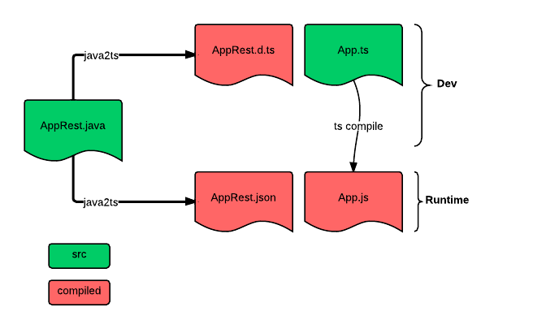

## Purpose

**Java2Typescript** provides a bridge between a **Java** REST service definition and a **Typescript** client. 

It enables to expose the full DTO model and REST services API as a clean typescript definition file, thus enabling strong type checking on the model of your application.

This project is composed of 3 modules :
* **java2typescript-jackson**: A [Jackson](http://jackson.codehaus.org/) module that generate **typescript** definition files for Java classes, using a Jackson ObjectMapper.
* **java2typescript-jaxrs**: An extension to **java2typescript-jackson** that takes a [JAX-RS](https://jax-rs-spec.java.net/) annotated java class and produces both :
 * A Typescript definition file of the service (`.d.ts`), together with description of all needed DTO objects.
 * A `.json` file with additional info : HTTP method (POST, GET), parameter's locations (path, form params, body, ..)
* **java2typescript-maven-plugin**: A maven plugin to automate the generation of `.d.ts` and `.json` files for a REST service

## Big picture

Here is a schema of the workflow for a typical project using **j2ts** :


There are only two source files here :
* Server side: `AppRest.java` with annotated JAX-RS services
* Client side: `App.ts` 

The detailed workflow is:

1. `AppRest.java` contains the annotated **JAX-RS** service definition
2. **j2ts** compiles the REST service definition into a `.d.ts` description file, `.json` file (for runtime)
3. `App.ts` imports and uses the `.d.ts` file.
4. `App.ts` is compiled into a `App.js` file
5. At runtime the statically provided `app2ts.js` adapter transforms the JSON decription of the service into a working javascript client.

# Jackson Module

This is a [Jackson](http://jackson.codehaus.org/) module.
It generates *TypeScript* definition files (.d.ts) for Java classes.


## Status

The Generator currently support the following *TypeScript* syntax :

* Primitives : bool, string, number
* Interfaces (from classes)
* Typed arrays
* Typed Maps
* Enums
* Methods

## Usage

Use the class **DefinitionGenerator** like so :
```java
	
ObjectMapper mapper = new ObjectMapper();
DefinitionGenerator generator = new DefinitionGenerator(mapper);

Module module = generator.generateTypeScript(//
    "moduleName", //
    newArrayList(//
           MyClass.class, //
           OtherClass.class));
           
module.write(outWriter);
```

## Sample output

```typescript

module MyModule {

export enum MyEnum {
    VAL1,
    VAL2,
    VAL3,
}

export interface TestClass {
    aString: string;
    aBoolean: bool;
    aInt: number;
    aFloat: number;
    stringArray: string[];
    map: { [key: string ]: bool;};
    recursive: TestClass;
    recursiveArray: TestClass[];
    aEnum: ChangedEnumName;
}

}
```


## Interface / Class name

By default, the name of the generated interfaces is the Java simple class name.
You can use the annotation **@JsonTypeName("CustomClassName")** to override it.

## Module name

The module name is optional. If null, the definition will be generated out of any module.

# Licence

This project is licenced under the [Apache v2.0 Licence](http://www.apache.org/licenses/LICENSE-2.0.html)


# Credits

Jackson module is inspired from the [jsonSchema module](https://github.com/FasterXML/jackson-module-jsonSchema)


